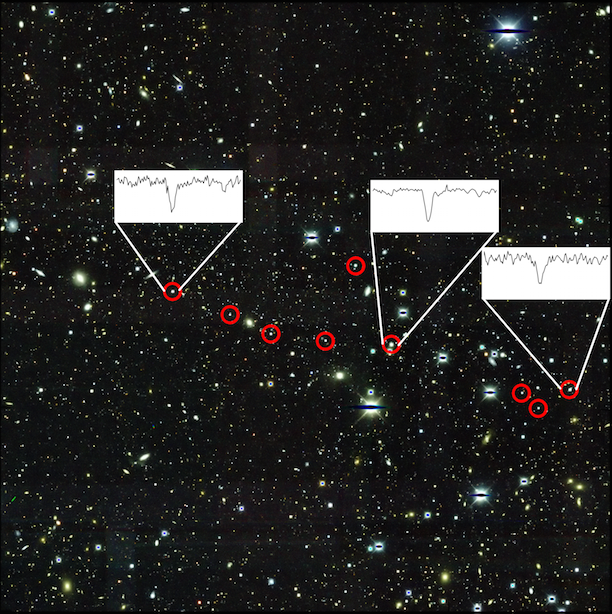

Welcome! I am a Hubble Fellow at Carnegie Observatories. I use Near Field Cosmology to study the first stars and galaxies.

My favorite galaxy is Reticulum II.

[Nature paper](http://www.nature.com/nature/journal/vaop/ncurrent/full/nature17425.html)

[News article by Carnegie Science](https://carnegiescience.edu/node/2014)

[Short Interview with MIT](http://news.mit.edu/2016/3-q-galaxy-origin-cosmos-heaviest-elements-0321)

The nine brightest stars in the r-process galaxy Reticulum II are circled. 
 
Three of these stars are highlighted, showing their large barium content.

I recently gave a talk at the Huntington Libraries about "Glimpses of the Cosmic Dawn", which you can watch here:
<iframe id="ls_embed_1557265625" src="https://livestream.com/accounts/14570535/events/8566659/videos/188883055/player?width=640&height=360&enableInfo=true&defaultDrawer=&autoPlay=true&mute=false" width="640" height="360" frameborder="0" scrolling="no" allowfullscreen> </iframe>

In 2017 I gave a talk titled "Searching for the First Stars" at the Carnegie Observatories Open House. You can watch it on YouTube!

<iframe width="560" height="315" src="https://www.youtube.com/embed/hDpc3qBv3aQ" frameborder="0" gesture="media" allowfullscreen></iframe>

Check out [The Caterpillar Project](http://www.caterpillarproject.org/). Here’s a quick video showing what it’s about. Video production credit to [Brendan Griffen](http://brendangriffen.com/).

<iframe width="625" height="469" src="https://www.youtube.com/embed/g1ti7i7Ay3c?feature=oembed" frameborder="0" allowfullscreen></iframe>
