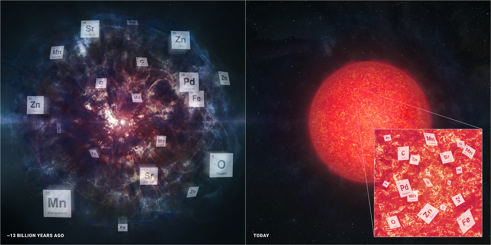

# Spectacular Nucleosynthesis in Early Massive Stars
We recently published a discovery of a star with spectacular chemical composition, discovered in [SDSS-V](https://sdss.org/).
It implies an explosion of an ancient star so massive that it should not have exploded, but we are at the limits of our theoretical supernova models.
The [paper](https://ui.adsabs.harvard.edu/abs/2024ApJ...961L..41J/abstract) is out and you can see my AAS press conference on [YouTube](https://www.youtube.com/live/XCd662aOmy4?si=BtsCACfPFL2gsvDP&t=1972).
A collection of articles from
[UChicago](https://news.uchicago.edu/story/scientists-find-unusual-star-hints-new-way-stars-can-die),
[SDSS-V](https://www.sdss.org/barbenheimer-star/),
[Astrobites](https://astrobites.org/2024/01/11/astrobites-at-aas-243-day-3/),
[Starts with a Bang](https://bigthink.com/starts-with-a-bang/milky-way-weirdest-star/),
[Calfornia Academy of Sciences](https://www.calacademy.org/explore-science/the-barbenheimer-star-and-exploding-white-dwarfs),
[ScienceAlert](https://www.sciencealert.com/ancient-gigantic-star-exploded-in-a-way-we-didnt-think-was-possible),
[Science Reader](https://sciencereader.com/science-update-barbenheimer-star-quantum-effects-and-innovative-robots/),
[Phys.org](https://phys.org/news/2024-01-discovery-unusual-star-picture-stars.html), and others.
<!--
[Interesting Engineering](https://interestingengineering.com/science/barbenheimer-study-finds-clues-of-ancient-explosion-in-an-extant-star),
[IFLScience](https://www.iflscience.com/barbenheimer-star-loaded-with-heavy-metals-is-unlike-anything-scientists-have-seen-or-expected-72466),
[The Science Times](https://www.sciencetimes.com/articles/48204/20240116/baffling-barbenheimer-star-defies-conventional-theories-cosmic-demise-element-creation.htm),
[Locgi News](https://www.locgi.com/science/barbenheimer-star-loaded-with-heavy-metals-is-unlike-anything-scientists-have-seen-or-expected-3038),
[ISP.Page](https://isp.page/news/a-star-with-a-mystical-past-discovering-the-barbenheimer-star/#gsc.tab=0),
[ISP.Page](https://isp.page/news/a-lone-stars-supernova-origins-unveiled/#gsc.tab=0),
[Meson Stars](https://www.mesonstars.com/space/researchers-have-found-the-remains-of-the-barbenheimer-star-it-damaged-the-known-laws-of-material-science-when-it-detonated/),
[BNN Breaking](https://bnnbreaking.com/tech/science-tech/milky-ways-barbenheimer-star-bears-unique-chemical-imprint-of-ancient-supernova/).
-->

|  | 
|:--:| 
| *Illustration of stellar archaeology, showing elements measured in the star J0931+0038.* |
| *Left: Illustration of supernova explosion with elements flying out from the center.* |
| *Right: Red giant star with pullout showing elements measured.* |
| *Image Credit: University of Chicago/SDSS-V/Melissa Weiss* |

# Popular Science Programs
I have been a scientific advisor for a few popular science videos.
* [You Are Not Where You Think You Are - Kurzgesagt](https://www.youtube.com/watch?v=Pj-h6MEgE7I)
* [SEARCHING with Alan Lightman](https://searchingformeaning.org/)

# Twelve for Dinner
The [S5 collaboration](https://s5collab.github.io/) published the first 6D map of twelve distant stellar streams ([paper](https://ui.adsabs.harvard.edu/abs/2021arXiv211006950L)) that will help reveal the dark matter distribution in the Milky Way. Press from [UToronto](https://www.dunlap.utoronto.ca/dozen_stellar_stream/), see details at [our website](https://s5collab.github.io/one_dozen_streams_press_release/).

# An extended halo around an ancient dwarf galaxy
[Anirudh Chiti](http://www.mit.edu/~achiti/) led a paper detecting the very outskirts of the dwarf galaxy Tucana II.
This is the furthest out that stars have been detected around a tiny galaxy. The paper is published in [Nature Astronomy](https://rdcu.be/ceAbh).
A collection of press from
[Carnegie](https://carnegiescience.edu/node/2706),
[MIT](https://news.mit.edu/2021/astronomers-detect-extended-dark-matter-halo-ancient-dwarf-galaxy-0201),
[The Guardian](https://www.theguardian.com/science/2021/feb/01/discovery-of-outer-stars-of-dwarf-galaxy-sheds-new-light-on-dark-matter),
[CNN](https://www.cnn.com/2021/02/02/world/dark-matter-halo-ancient-galaxy-scn-trnd/index.html),
[Sky and Telescope](https://skyandtelescope.org/astronomy-news/our-tiny-galactic-neighbor-hosts-ancient-stars/).

# A primitive stellar stream

The [S5 survey](https://s5collab.github.io/) has discovered the most metal-poor known globular cluster in the Milky Way.
It is being actively tidally shredded by the Milky Way.
A collection of news articles from
[Carnegie](https://carnegiescience.edu/news/stellar-archaeology-reveals-remnant-ancient-globular-cluster-thats-last-its-kind), 
[VICE](https://www.vice.com/en_us/article/k7qp3a/scientists-found-an-ancient-graveyard-of-anomalous-stars-in-our-galaxys-halo),
[Sydney Morning Herald](https://www.smh.com.au/national/australian-scientists-discover-dying-building-block-of-milky-way-20200729-p55gin.html),
[Sky and Telescope](https://skyandtelescope.org/astronomy-news/remains-of-an-ancient-star-cluster-revealed/),
[Chicago Tribune (in Spanish)](https://www.chicagotribune.com/espanol/entretenimiento/sns-es-arqueologia-estelar-via-lactea-cumulo-globular-ciencia-20200729-5dswqmg72vbvvgfrjwhcdil7ke-story.html),
and
[CNET](https://www.cnet.com/news/astronomers-find-a-dying-remnant-from-star-cluster-that-shouldnt-have-existed/).
[The Galactic Times](https://podcasts.apple.com/us/podcast/ep-4-august-5-2020-over-solar-systems-horizon-phoenix/id1519876423?i=1000487330923) produced a podcast about the Phoenix stream.

# A hyperfast runaway star

The [S5 survey](https://s5collab.github.io/) serendipitously found the first known star to be kicked out from our galaxy's central black hole. Here are a collection of news articles from
[Carnegie](https://carnegiescience.edu/node/2570), 
[the New York Times](https://www.nytimes.com/2019/11/14/science/stars-black-hole-milky-way.html),
[CBS News](https://www.cbsnews.com/amp/news/black-hole-supermassive-black-hole-throws-star-out-of-milky-way-galaxy-3point7-million-mph-today/),
and
[Space Australia](https://spaceaustralia.com/feature/supermassive-black-hole-ejects-hyper-velocity-star).

# The First Stars, Like, Ever
In 2020 I gave an online talk at Astronomy on Tap with [Dr. Brittany Kamai](https://sites.google.com/site/brittanykamai). You can watch it on YouTube!

<iframe width="560" height="315" src="https://www.youtube.com/embed/B8W-0VzFa90?start=2691" frameborder="0" allow="accelerometer; autoplay; encrypted-media; gyroscope; picture-in-picture" allowfullscreen></iframe>

# Glimpses of the Cosmic Dawn
In 2019 I gave a talk at the Huntington Libraries about "Glimpses of the Cosmic Dawn", which you can watch here:
<iframe id="ls_embed_1558501032" src="https://livestream.com/accounts/14570535/events/8566659/videos/188883055/player?width=640&height=360&enableInfo=false&defaultDrawer=&autoPlay=false&mute=false" width="640" height="360" frameborder="0" scrolling="no" allowfullscreen> </iframe>

# Searching for the First Stars
In 2017 I gave a talk titled "Searching for the First Stars" at the Carnegie Observatories Open House. You can watch it on YouTube!

<iframe width="560" height="315" src="https://www.youtube.com/embed/hDpc3qBv3aQ" frameborder="0" gesture="media" allowfullscreen></iframe>

# The R-Process Galaxy Reticulum II
My favorite galaxy is Reticulum II.

[Nature paper](http://www.nature.com/nature/journal/vaop/ncurrent/full/nature17425.html)

[News article by Carnegie Science](https://carnegiescience.edu/node/2014)

[Short Interview with MIT](http://news.mit.edu/2016/3-q-galaxy-origin-cosmos-heaviest-elements-0321)

[New in 2021! Update on the search for gold](https://www.pnas.org/content/118/4/e2026110118)

The nine brightest stars in the r-process galaxy Reticulum II are circled. 
 
Three of these stars are highlighted, showing their large barium content.

# The Caterpillar Project
Check out [The Caterpillar Project](http://www.caterpillarproject.org/). Here’s a quick video showing what it’s about. Video production credit to [Brendan Griffen](http://brendangriffen.com/).

<iframe width="625" height="469" src="https://www.youtube.com/embed/g1ti7i7Ay3c?feature=oembed" frameborder="0" allowfullscreen></iframe>

<!--
Other articles I have commented on.
https://www.sciencenews.org/article/supernova-heavy-elements-source-earth-crust-deep-sea
-->
